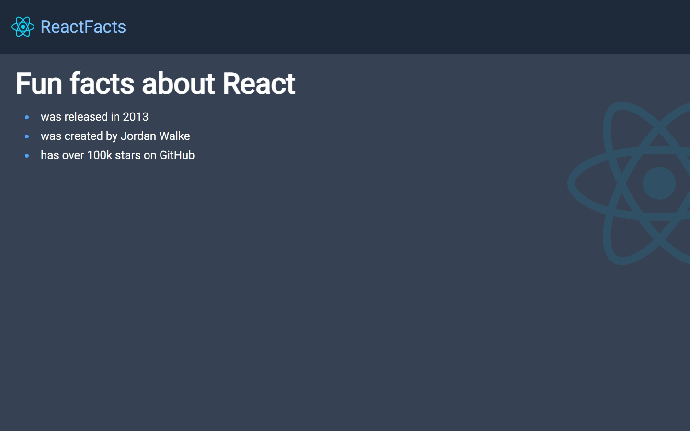
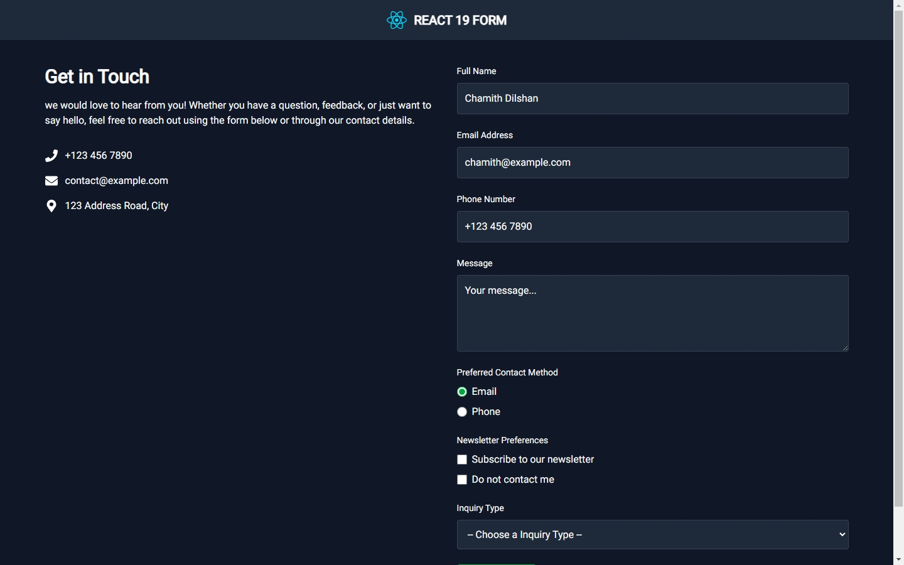
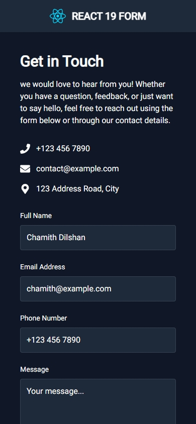
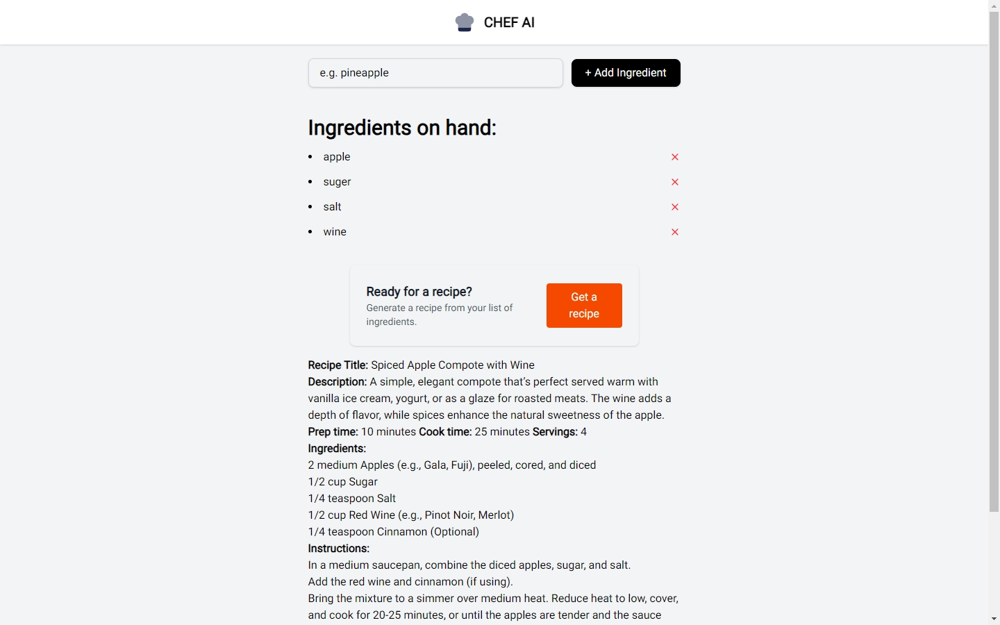
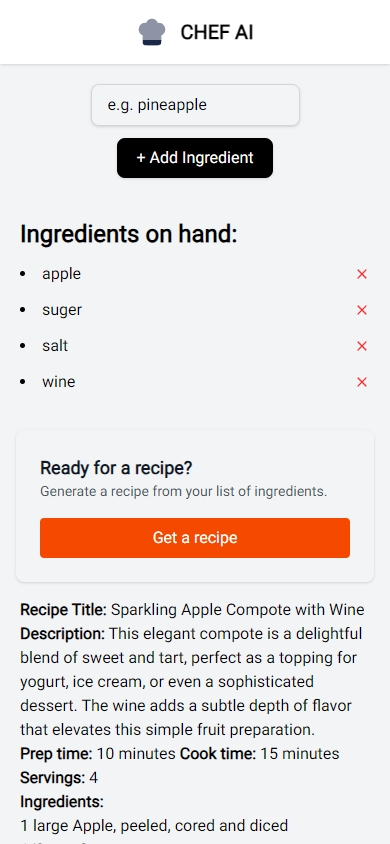
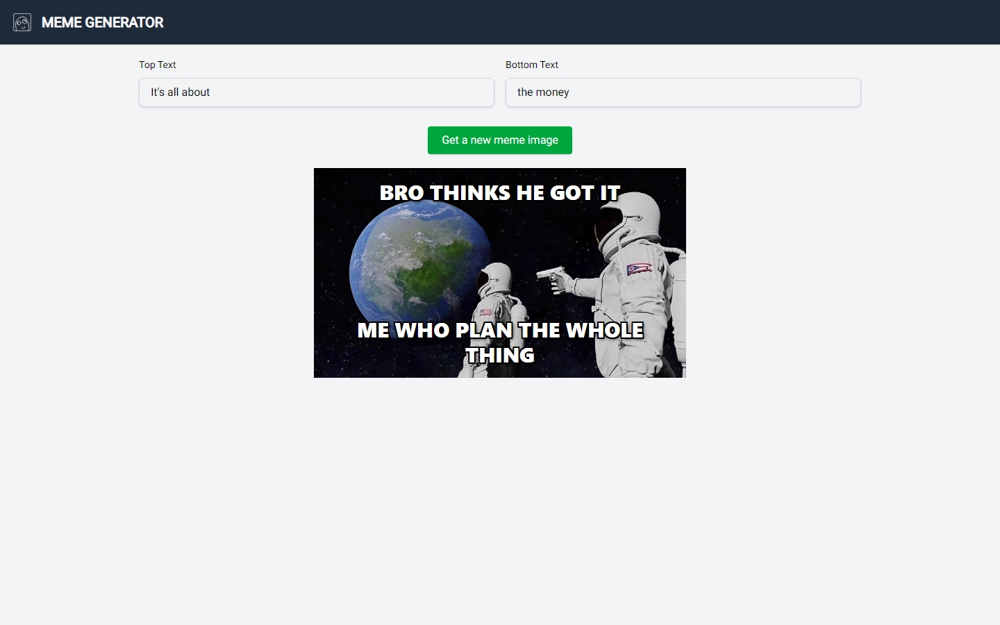
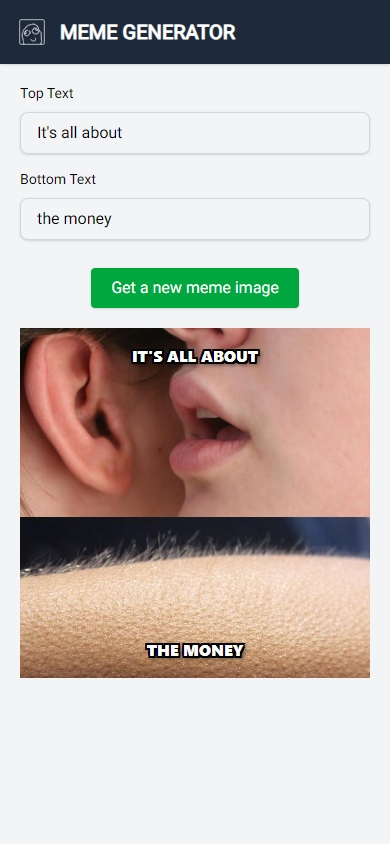

# React Learning Projects (React + TypeScript + Tailwind + Vite)

This repository is a collection of small React projects built to demonstrate various core concepts, from basic component structure to advanced features. It serves as a practical guide and a hands-on learning resource.

## Project Screenshots

### Simple Data List
Build a simple page to get your hands dirty.

| Desktop View | Mobile View |
| :---: | :---: |
|  |  |

### Travel Journal
A responsive component that displays a list of travel entries.

| Desktop View | Mobile View |
| :---: | :---: |
|  |  |

### Simple Form
A modern contact form built using React 19 features.

| Desktop View | Mobile View |
| :---: | :---: |
|  |  |

### Chef AI
An AI intregrated app that gives you an recepie depends on a list of ingredients you provided.

| Desktop View | Mobile View |
| :---: | :---: |
|  |  |

### Meme Generator
A fun meme generator that fetches popular meme templates and allows you to add custom text.

| Desktop View | Mobile View |
| :---: | :---: |
|  |  |


## Featured Libraries

### `tailwind-merge`
A utility function for merging Tailwind CSS classes in JS without style conflicts. It's essential for creating reusable components where you want to allow style overrides via props. It intelligently handles conflicting classes (like `bg-red-500` and `bg-blue-500`) by ensuring only the last one is applied.

**Usage:**
```jsx
import { twMerge } from 'tailwind-merge';

// The output will be 'p-4 bg-blue-500'
const mergedClasses = twMerge('p-4 bg-red-500', 'bg-blue-500'); 
```

### `react-icons`
A library that makes it easy to include popular icons in your React projects. It bundles icons from various sets (like Font Awesome, Material Design, etc.) as individual, tree-shakeable React components.

**Usage:**
```jsx
import { FaPhone } from 'react-icons/fa';

const MyComponent = () => <FaPhone />;
```
### `react-markdown`
A library that help to render Markdown as HTML. It's essential for displaying user-generated content or, in this case, the formatted recipe from the AI response.

**Usage:**
```jsx
import ReactMarkdown from 'react-markdown';

const markdown = '# Hello, world!';
const MyComponent = () => <ReactMarkdown>{markdown}</ReactMarkdown>;
```

## React Learning Points in This Repo

### 1. Building Reusable Components (`NavBarComp.tsx`)
- **Component Props:** Designing components that can be configured with different data (title, image source).
- **Style Overrides:** Using `tailwind-merge` to allow parent components to safely override default styles via a `containerClass` prop.
- **Layout:** Creating a sticky header that remains at the top of the viewport during scrolling.

### 2. Component Creation and Data Rendering (`TravelJournal.tsx`)
- **Prop Passing:** Creating reusable components (`DetailCard`) that accept data through props.
- **Fetch Data From A External Source:** Here we mimic data retrival from a DB, even thought we do not use any DB, the process is similar.
- **Rendering Lists:** Using the `.map()` method to dynamically render a list of components from a data array.
- **TypeScript Integration:** Defining `interface` types for props and data objects to ensure type safety.
- **Responsive Design:** Using Tailwind's responsive prefixes (`md:`, `lg:`) to create layouts that adapt to different screen sizes.

### 3. Modern Form Handling with React 19 (`SimpleForm.tsx`)
- **Form Action:** Using the `<form action={...}>` prop to handle submissions without `useState` or manual `preventDefault()` calls.
- **Uncontrolled Components:**  from React 19 you can simply use action attribute to submit form data 
    to the server without any page reload or reset React will take care of all the 
    default part that we need to do in previous versions.you no longer need to provide 
    a 'method' prop to the form as well.In the Old way, you need to use 'UseState' of React and
    use 'value', 'onChange' props of the input fields and manage form actions and data.
    This whole setup is called control componets. Now you can use form 'action' prop to handel this.
- **`FormData` API:** Accessing submitted data within the action function, including using `formData.get()` for single values and `formData.getAll()` for multiple values (like checkboxes).
- **Styling Form Elements:** Customizing radio buttons and checkboxes with Tailwind CSS and the `accent-color` utility.

### 4. State, API, and Performance (`ChefAI.tsx`)
- **Ollama:** For this part you need to have up and running ollama in your local environment. And don't forget to change the code and add your own model.
- **Streaming API Requests:** Consuming a streaming response from an API (`fetch` with `ReadableStream`) to display real-time data from the Ollama model.
- **State Management:** Using the `useState` hook to manage arrays, loading states, and streaming text content.
- **Event Handling & Listeners:** Capturing user actions with `onSubmit` for forms and `onClick` for buttons.
- **Conditional Rendering:** Displaying UI elements based on application state, such as showing the "Generate Recipe" button only when ingredients are present, and rendering loading, error, or content states in the response card.
- **Unique Keys:** Generating unique IDs for list items using `crypto.randomUUID()` to ensure efficient rendering and state management.
- **Controlled Components:** In some cases you have to use controlled component meaning that you need to use a 'useState' and 'onChange' parameter of input elements to collect and manage forms.(if the case is simple enough, use the new way of form handeling )
---

### 5. API Integration and Data Fetching (`MemeGenerator.tsx`)
- **useEffect Hook:** Fetching data from an external API only once when the component mounts using `useEffect` with an empty dependency array.
- **API Data Management:** Storing fetched data in component state for later use without re-fetching.
- **Random Selection:** Implementing logic to randomly select items from an array of fetched data.
- **Error Handling:** Basic error handling for API requests using `.catch()`.
- **State Updates:** Updating specific properties of an object state while preserving other properties using the spread operator.
- **Custom CSS Classes:** Creating reusable utility classes with Tailwind's `@apply` directive for complex styling like text shadows.
- **Absolute Positioning:** Using CSS positioning to overlay text on images at specific locations.

## Contributing & Support

Contributions are welcome! If you have suggestions for improvements or find any issues, please feel free to open an issue or submit a pull request.

If you find this repository useful, please consider giving it a ⭐ star