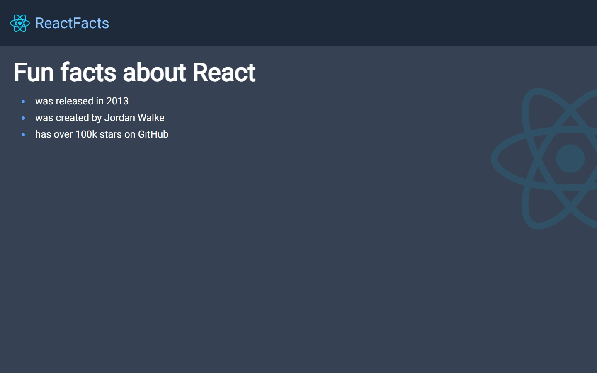
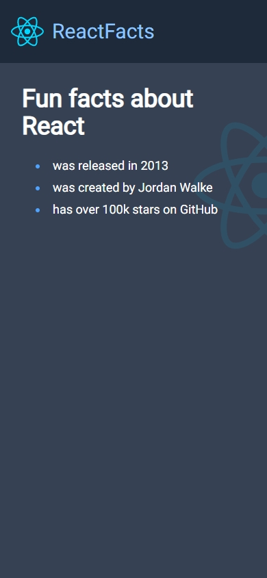
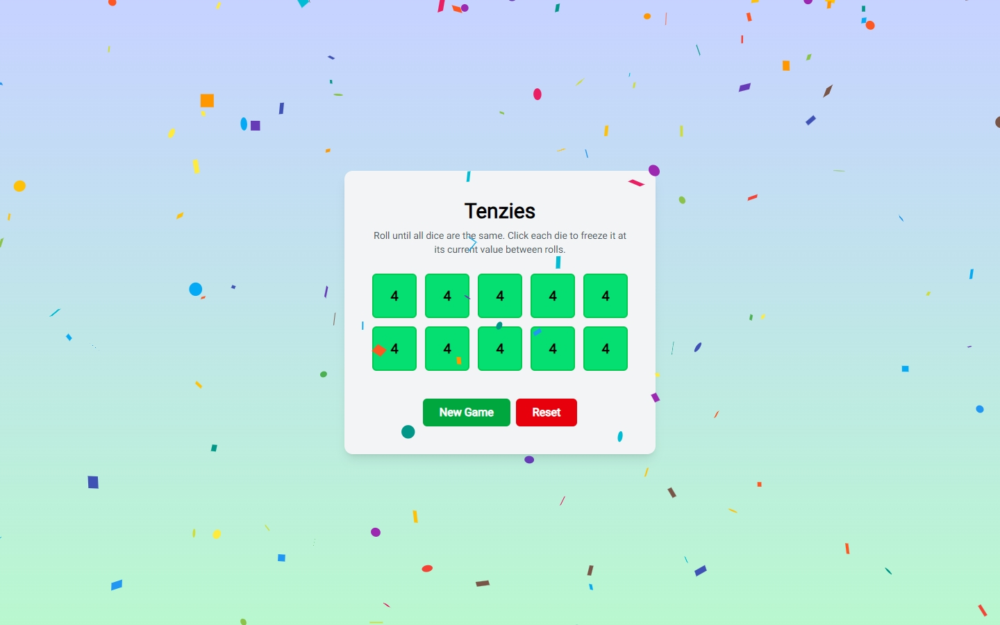
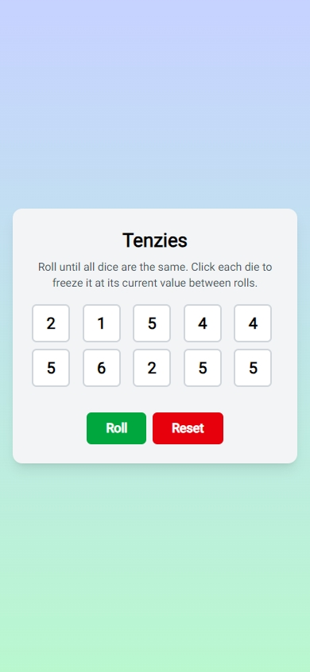
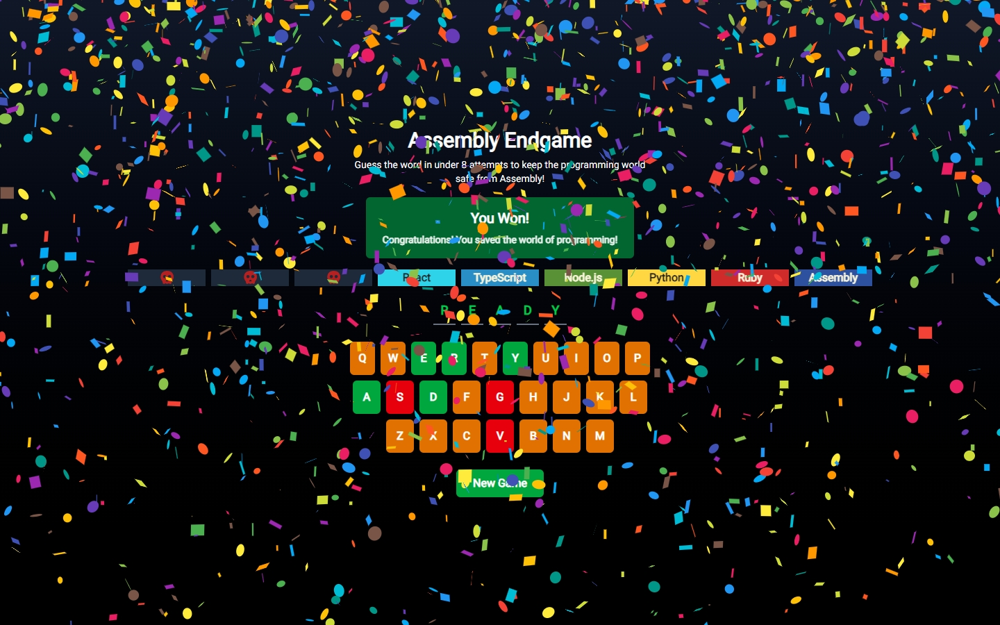
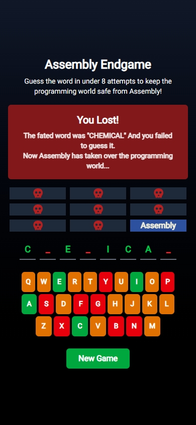

<div align="center">

# 🚀 React Learning Projects
### *React + TypeScript + Tailwind + Vite*

<p align="center">
  <strong>A comprehensive collection of React projects showcasing core concepts from basic components to advanced features</strong>
</p>

<p align="center">
  
  
  
  
</p>

<p align="center">
  <a href="#-projects-showcase">🎯 Projects</a> •
  <a href="#-featured-libraries">📚 Libraries</a> •
  <a href="#-react-learning-points">🧠 Learning Points</a> •
  <a href="#-contributing--support">🤝 Contribute</a>
</p>

---

</div>

## 🎯 Projects Showcase

<div align="center">

### 📄 Static Pages
> *Responsive layouts with semantic HTML and modern CSS techniques*

| 🖥️ Desktop View | 📱 Mobile View |
|:---:|:---:|
|  |  |

### ✈️ Travel Journal
> *Dynamic data rendering with responsive card layouts*

| 🖥️ Desktop View | 📱 Mobile View |
|:---:|:---:|
|  |  |

### 📝 Simple Form (React 19)
> *Modern form handling with React 19's new features*

| 🖥️ Desktop View | 📱 Mobile View |
|:---:|:---:|
|  |  |

### 🤖 Chef AI
> *AI-powered recipe generation with HTTP streaming*

| 🖥️ Desktop View | 📱 Mobile View |
|:---:|:---:|
|  |  |

### 😂 Meme Generator
> *Dynamic meme creation with external API integration*

| 🖥️ Desktop View | 📱 Mobile View |
|:---:|:---:|
|  |  |

### 🎲 Tenzies Game
> *Interactive dice game with animations and accessibility*

| 🖥️ Desktop View | 📱 Mobile View |
|:---:|:---:|
|  |  |

### ⚔️ Assembly Endgame
> *Programming-themed word game with visual effects*

| 🖥️ Desktop View | 📱 Mobile View |
|:---:|:---:|
|  |  |

</div>

## 📚 Featured Libraries

<div align="center">

> **Powerful tools that enhance development experience and user interactions**

</div>

### 🎨 `tailwind-merge`
**Smart CSS class merging for conflict-free styling**

```jsx
import { twMerge } from 'tailwind-merge';

const mergedClasses = twMerge(
  'bg-indigo-600 hover:bg-indigo-700 text-white font-semibold px-6 py-2 rounded-md',
  containerClass
); 
```

### 🎯 `react-icons`
**Tree-shakeable icon components from popular icon sets**

```jsx
import { FaPhone } from 'react-icons/fa';
const MyComponent = () => <FaPhone />;
```

### 📝 `react-markdown`
**Secure Markdown to HTML rendering for dynamic content**

```jsx
import ReactMarkdown from 'react-markdown';
const MyComponent = () => <ReactMarkdown>{markdown}</ReactMarkdown>;
```

### 🔑 `nanoid`
**Tiny, secure, URL-friendly unique ID generator**

```jsx
import { nanoid } from 'nanoid';
const id = nanoid(); // "V1StGXR8_Z5jdHi6B-myT"
```

### ⚡ `gsap` (GreenSock Animation Platform)
**High-performance JavaScript animation library**

```jsx
import { gsap } from 'gsap';
gsap.to(element, { x: 100, duration: 2 });
```

### 🎊 `react-confetti`
**Customizable confetti effects for celebrations**

```jsx
import Confetti from 'react-confetti';
const MyComponent = () => (
  <Confetti width={window.innerWidth} height={window.innerHeight} />
);
```

## 🧠 React Learning Points in This Repo

<div align="center">

**Comprehensive breakdown of React concepts, patterns, and best practices demonstrated in each project**

</div>

<details>
<summary><strong>📋 Quick Overview of Topics Covered</strong></summary>
<br>

- 🎨 **Layout & Responsive Design** - Flexbox, Grid, Tailwind responsive patterns
- 🔄 **State Management** - useState, useEffect, derived state, functional updates
- 🌐 **API Integration** - HTTP streaming, data fetching, error handling
- 📝 **Form Handling** - React 19 features, controlled/uncontrolled components
- 🎮 **Game Logic** - Complex state management, win conditions, animations
- ♿ **Accessibility** - ARIA attributes, screen readers, keyboard navigation
- 🚀 **Performance** - Lazy initialization, cleanup patterns, optimization
- 🔧 **TypeScript** - Interfaces, type safety, proper typing patterns

</details>

---

---

## 🤝 Contributing & Support

<div align="center">

**Love this project? Here's how you can help! 💪**

<p>
<a href="https://github.com/Chamith-Dilshan/React_Basic_To_Advanced/issues">🐛 Report Bug</a> •
<a href="https://github.com/Chamith-Dilshan/React_Basic_To_Advanced/issues">💡 Request Feature</a> •
<a href="https://github.com/Chamith-Dilshan/React_Basic_To_Advanced/fork">🍴 Fork & Contribute</a>
</p>

### ⭐ Star this repository if it helped you!

<p>


</p>

**Built with ❤️ for the React community**

</div>

---

<div align="center">
<sub>This project is maintained by <a href="https://github.com/Chamith-Dilshan">@Chamith-Dilshan</a></sub>
</div>
